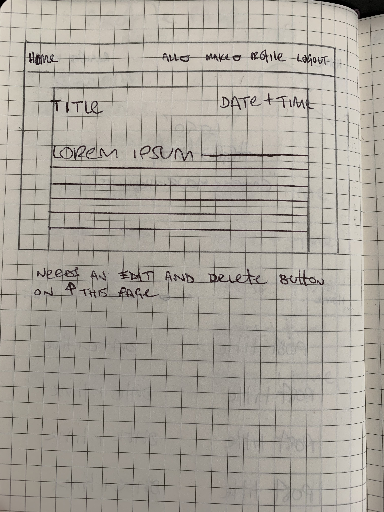
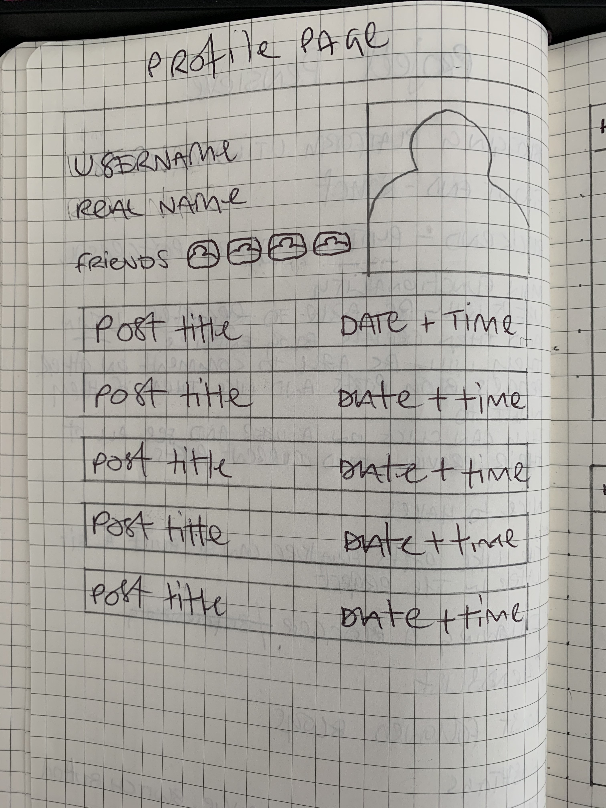

# sei-final-project

# Software Engineering Immersive: Project 4
This was the fourth and last project I built whilst studying the Software Engineering Immersive course at General Assembly.

This application was also built in 1 week.

## Team members
This application was built by me and my fellow cohort member
+ [Latch Jack](https://github.com/latchjack)

# Pensive

## Brief
The projects necessary requirements were..
* Choose to work solo or in a team
* **Build a full-stack application** by making your own backend and your own front-end
* **Use a Python Django API** using Django REST Framework to serve your data from a Postgres database
* **Consume your API with a separate front-end** built with React
* **Be a complete product** which most likely means multiple relationships and CRUD functionality for at least a couple of models
* **Implement thoughtful user stories/wireframes** that are significant enough to help you know which features are core MVP and which you can cut
* **Have a visually impressive design** to kick your portfolio up a notch and have something to wow future clients & employers. 
* **Be deployed online** so it's publicly accessible.


## Tech Stack
+ HTML5
+ SCSS & Bulma
+ Javascript
  * ECMAScript6
  * React.js
  * axios
+ Python
  * Django
+ PostgreSQL
+ Testing
  * Manual: Insomnia
  * Table Plus
+ Git & GitHub
+ Heroku

## Release History
1.0 - Date of submission and deployment (04/03/20).

## Deployment
This application is deployed on Heroku and it can be found here - [Pensive](https://pensiveworld.herokuapp.com/)

## Approach
### Planning
From the announcement of another project I knew I wanted to build a blogging platform as I enjoy reading articles on [Medium](https://medium.com/) and [Dev.to](https://dev.to/). We thought it would be a great way to enhance our knowledge of databases and the relationships of models.

We spent the first day of our project fleshing out the idea and discussing how we would build our platform.

I made some sketches of how we could lay out the project out in my notebook

A homepage with just the `Home`, `Register` and `Login` buttons available. All the other navbar items would only appear after logging in


A sketch how we wanted to lay out our articles


A sketch of the layout for a user's profile



### Backend
**Models**
Our backend was served by a PostgreSQL database. We used Table Plus to interact with data and check everything was being stored correctly. We created three tables, Articles, Categories and Users (JWT_Auth).

Our User model was quite simple as we planned on adding more functionality to it later. The only extra field that was added was the email field to allow registration.

```py
class User(AbstractUser):
  email = models.CharField(max_length=40, unique=True)

  def __str__(self):
    return f'{self.username} - {self.id}'
```

Our Category model only needed to have a name field because the name of the category would be attached to an article. This would be one of our **many-to-many** relationships as many articles can have many categories.
```py
class Category(models.Model):
    category_name = models.CharField(max_length=50)

    def __str__(self):
      return self.category_name
```

Our most intricate model was our Article model. It had fields for the article's title, owner, date, text and categories.
It also had other models that were nested within in such as the Comment and Like models. Likes were one of our **one-to-many** relationships as a user can apply one like to each article.
```py
class Article(models.Model):
  title = models.CharField(max_length=50)
  owner = models.ForeignKey(User, related_name='articles', null=True, on_delete=models.CASCADE)
  date = models.DateTimeField(default=timezone.now)
  text = models.CharField(max_length=3000)
  categories = models.ManyToManyField('categories.Category', related_name='categories', blank=True)


  def __str__(self):
    return self.title

class Comment(models.Model):
  text = models.CharField(max_length=140)
  owner = models.ForeignKey(User, related_name='comments', null=True, on_delete=models.CASCADE)
  article = models.ForeignKey(Article, related_name="comments", null=True, on_delete=models.CASCADE)   

  def __str__(self):
    return f'Comment by {self.owner} / {self.id} on {self.article}'
    
class Like(models.Model):
  like = models.IntegerField(default=0)
  owner = models.ForeignKey(User, related_name='likes', null=True, on_delete=models.CASCADE)
  article = models.ForeignKey(Article, related_name="likes", null=True, on_delete=models.CASCADE)

  def __str__(self):
    return f'Like by {self.owner} on {self.article}'
```

**API End-points**

#### 1. User


|           | GET | PUT | POST | DELETE |
|-----------|-----|-----|------|--------|
| /register |     |     |   X  |        |
| /login    |     |     |   X  |        |

+ Register - this uses a Post request to store the user's inputted information into the database.
+ Login - this uses a Post request however it check that the user's credentials match up to the stored data. If the match is made it will issue a token for the user to access the site.

#### 2. Articles

|                                              | GET | PUT | POST | DELETE |
|----------------------------------------------|-----|-----|------|--------|
| article/\<int:pk>                            |  X  |  X  |  X   |    X   |
| article/\<int:pk>/comments                   |     |     |  X   |        |
| article/\<int:pk>/comments/\<int:comment_pk> |     |     |  X   |        |
| article/\<int:pk>/likes/                     |     |     |  X   |        |
| article/\<int:pk>/likes/\<int:like_pk>       |     |     |  X   |        |

+ Articles - the articles use a Post request to be submitted by a user, they are then edited by using a Put request and they are read by using Get requests.
